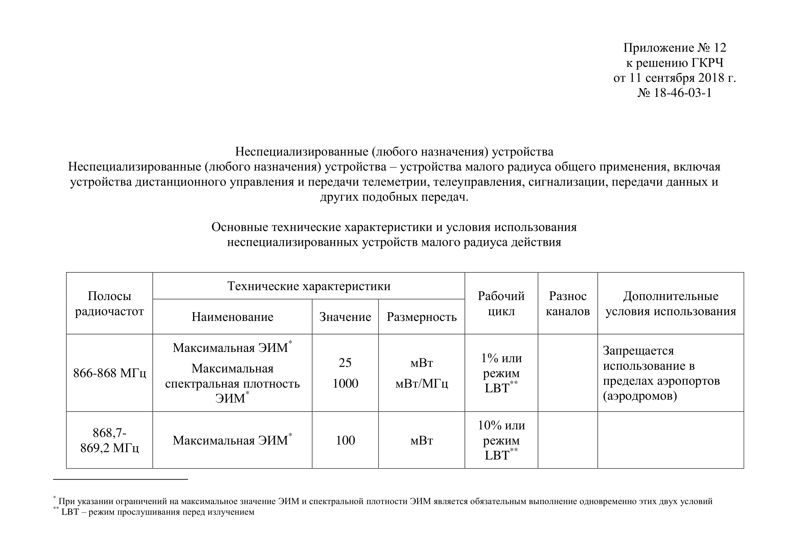

# Законы которые важно знать и соблюдать

---

## Антенны на крыше:

- Жилищный кодекс РФ: крыша многоквартирного дома является общим имуществом собственников (ст. 36 ЖК РФ), и для использования такого имущества (в том числе размещения антенн) нужно согласие собственников.

- Постановление Госстроя РФ от 27.09.2003 № 170 «Правила и нормы технической эксплуатации жилищного фонда» — содержит пункт 4.6.1.20, согласно которому установка антенн, внесение изменений в элементы крыш и др. без утверждённого проекта не допускается.

## Мощность и частоты

[Источник: digital.gov.ru](https://digital.gov.ru/uploaded/files/prilozhenie-12-k-reshenyu-gkrch-18-46-03-1.pdf)
