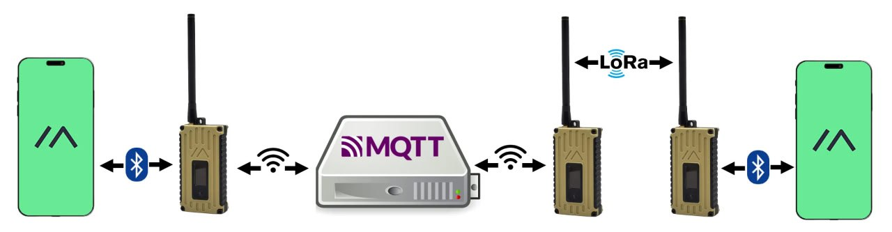
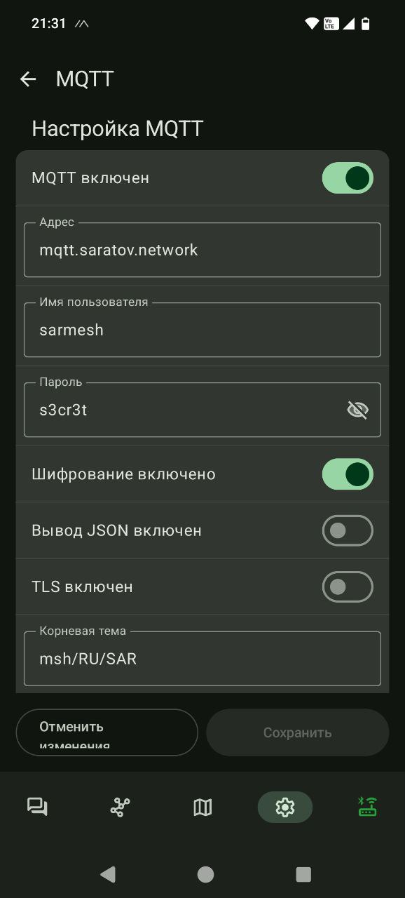
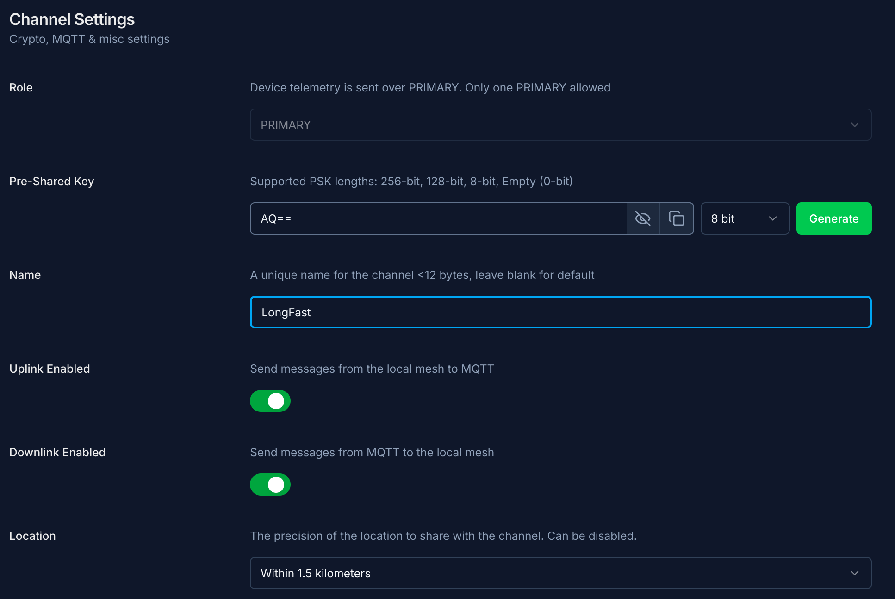

# TL;DR
```
MQTT включен: да
Адрес: mqtt.saratov.network
Имя пользователя: <не имеет значения>, можете задать sarmesh
Пароль: s3cr3t
Шифрование включено: да
Вывод JSON включен: нет
TLS включен: нет
Корневая тема: msh/RU/SAR
Прокси клиенту включен: если вы раздаёте интернет через телефон, то да, иначе нет
Отчёты по карте: да (подробности далее)
```

# Что такое MQTT и зачем оно нужно



Протокол [MQTT](https://mqtt.org/) разработан для передачи коротких сообщений, таких как метрики, телеметрия, управляющие команды и т.д., в среде [IoT](https://en.wikipedia.org/wiki/Internet_of_things). Передача осуществляет посредством TCP/IP. В сети [Meshtastic](https://meshtastic.org/) этот протокол используется для обмена сообщениями между нодами, в случаях, когда связь через [LoRa](https://ru.wikipedia.org/wiki/LoRa) не доступна, а также для сбора статистики и последующего анализа работы разных аспектов сети. 

## Как это работает
В сети Интернет размещён сервер, который принимает сообщения от нод по протоколу MQTT и любая нода может получать интересующие её сообщения с этого сервера. Нода не может быть подключена к нескольким серверам одновременно. Отсюда вытекает проблема сегментации сети, когда разные группы нод подключены к разным серверам и не могут общаться между собой.
В [нашем варианте](mqtt.saratov.network) реализации сервера эта проблема решается двунаправленной связью между официальным сервером `mqtt.meshtastic.org` и сервером саратовского сообщества `mqtt.saratov.network`. Таким образом, нода подключенная к одному из этих серверов может обмениваться сообщениями с нодами подключенными к другому серверу.
Но всё же рекомендуется подключать ноду к саратовскому серверу, т.к. на нём, в том числе, [собирается статистика](https://malla.saratov.network/), которая, мало того, что интересна сама по себе, но и позволяет анализировать состояние сети с целью выявления проблем и поиска возможностей для оптимизации работы местной сети.

# Настройка ноды для работы с MQTT

Во-первых, нода должна иметь доступ в сеть Internet. Это можно обеспечить двумя способами:
1. подключить ноду к домашней сети WiFi; в этом случае желательно обеспечить автономное питание, т.к. потребление заряда сильно вырастет
2. раздать интернет с телефона, если нода подключена к нему по Bluetooth.

После этого в настройках модуля MQTT необходимо прописать параметры подключения:



```
MQTT включен: да
Адрес: mqtt.saratov.network
Имя пользователя: <не имеет значения>, можете задать sarmesh
Пароль: s3cr3t
Шифрование включено: да
Вывод JSON включен: нет
TLS включен: нет
Корневая тема: msh/RU/SAR
Прокси клиенту включен: если вы раздаёте интернет через телефон, то да, иначе нет
Отчёты по карте: да (подробности далее)
```

## Режимы передачи данных в MQTT



Передача данных от ноды в MQTT и обратно осуществляется через [каналы](https://meshtastic.org/docs/configuration/radio/channels/). В настройках по-умолчанию задан только один канал `LongFast` с общим ключом шифрования `AQ==`.

Если включен `Uplink Enabled`, то все сообщения полученные нодой в этом канале будут передаваться также и через MQTT.
Если включен `Downlink Enabled`, то все сообщения этого канала полученные из MQTT будут транслироваться в канал по LoRa.

Таким образом, если вы планируете только публиковать свои метрики (геолокация, информация о ноде и соседях, и .т.д.), то достаточно будет включить только `Uplink`. Если вы хотите передавать и получать сообщения через MQTT, то нужно включать и `Uplink` и `Downlink`.

## Варианты публикации геолокации

На данный момент существует два способа передать геолокацию с ноды:
1. с помощью передачи метрик в канал
2. трансляция геолокации с помощью модуля MQTT 

Если целью трансляции геолокации является только отображение ноды на карте, стоит использовать возможности модуля `MQTT` и отключить передачу геолокации через общие каналы. В этом случае передача позиции будет осуществляться, по-умолчанию, раз в час и не будет ретранслироваться в эфир.

# Список карт с геолокацией

На данный момент мы публикуем полученную публичную геолокацию нод на следующие карты:
- [почти официальная карта проекта meshtastic](https://meshmap.net/)
- [карта проекта onemesh.ru](https://map.onemesh.ru/)
- [карта от liamcottle](https://meshtastic.liamcottle.net/)
- [карта саратовского сообщества](https://malla.saratov.network/map)

# Полезные ссылки
- заходите к нам в [телеграм канал](https://t.me/meshtastic64); там весело и интересно
- [страница саратовского сообщества](https://meshtastic-saratov.github.io/)
- [чат на sarmesh.zulipchat.com](https://sarmesh.zulipchat.com/#narrow/channel/536715-.D0.BE.D0.B1.D1.89.D0.B5.D0.B5) для более структурированного общения
- [состояние наших сетевых сервисов](https://status.saratov.network/); да, мы знаем, что это важно:)
